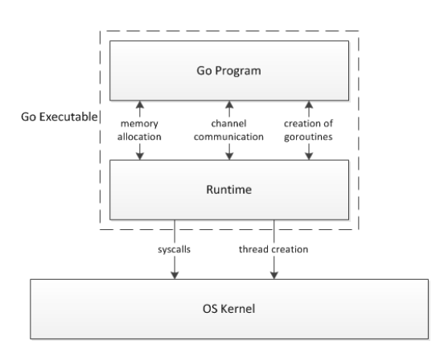

# Go 

Es un lenguaje de programación compilado, multi-paradigma y estáticamente tipado diseñado por Google. Este es sintácticamente muy parecido de __C__, pero con seguridad de memoria, garbage collection entre otras funcionalidades más típicas de lenguajes de alto nivel. El lenguaje fue diseñado en 2007 para abordar las críticas a los lenguajes de desarrollo de la empresa hasta el momento a la para que conservar sus características útiles:

- Tipado estático y eficacia en tiempo de ejecución de __C++__
- Legibilidad y usabilidad de __Python__ y __JavaScript__
- Multiprocesamiento y manejo de red de alto rendimiento 

**Go** pertenece principalmente a la familia de los lenguajes __C__, lo que es determinante en su sintaxis, pero se encuentra influenciado por otras grandes familias como Pascal/ Modula/ Oberon. Pero sin lugar a dudas una de las características más señalable de **Go** es su protocolo de concurrencia incorporada, dicha característica encuentra su precedente en lenguajes como Newsqueak, Limbo, Alef y el articulo _“Communicating Sequential Processes”_ de Tony Hoare.

El artículo CSP se publicó antes de que se popularizara las computadoras multinúcleos. Hoare vio problemas potenciales con la comunicación entre procesos que se ejecutan al mismo tiempo en procesadores separados. El modelo en ese momento para la comunicación entre procesos incluía muchos de los mecanismos aún primitivos para la comunicación por hilos de hoy en día; es decir, modificar la memoria compartida con la ayuda de mecanismos de bloqueo para proteger regiones críticas. En este modelo es difícil de razonar y obliga a los programadores a roper su usuale pensamiento secuencial, lo cual es extremadamente propenso a errores y complejiza enormemente el trabajo. La solución propuesta por Hoare incluía un conjunto separado de primitivas para fomentar el paso de mensajes entre procesos, en lugar de alterar la memoria compartida.

El patrón de concurrencia incorporada de **Go** es una materialización de muchas de las ideas de Hoare. Por ejemplo, Hoare describió el uso de **Goroutinas**, la comunicación de **canales** e incluso la declaración de **select** (aunque se los denomina con diferentes nombres). En ese momento, la propuesta de Hoare en el artículo CSP era puramente teórica, pero ahora que la tecnología ha avanzado, podemos ver que sus ideas para el procesamiento concurrente fueron valiosas y continúan siendo relevantes casi 35 años después. Newsqueak, un miembro destacado en la larga lista de lenguajes basados ​​en CSP, fue el primero de la familia (Pan, Promela, Squeak) en tener canales de primera clase. El estudio de Newqueak y los lenguajes entes expuestos, además de las ideas de Hoare, permitió la elegante composición de canales y funciones de comunicación entre proceos "simultaneos" más complejas en **Go**.

# Concurrencia y Paralelismo:
	
En el mundo del multiprocesamiento concurrencia y paralelismo son dos términos de frecuente uso, más aún desde la aparición de los procesadores multinúcleos. Pero estos términos generalmente provocan confusión entre ellos. 

### Concurrencia: 
Es la capacidad de una computadora de manejar múltiples tareas a la vez, aun cuando la misma solo tenga un único núcleo de su procesador. La concurrencia encuentra su materialización en los protocolos _scheduler_ programados en los distintos sistemas operativos y otros programas que deseen simular paralelismo cuando el motor de procesamiento subyacente solo puede con una tarea a la vez. En estos protocolos se define según distintos parámetros la prioridad, orden y tiempo que se le permitirá a una tarea en concreto utilizar el motor de procesamiento subyacente para ejecutarse, y así regular y alternar el uso del motor de procesamiento para sacar adelante varias tareas “al mismo tiempo”

### Paralelismo:
Esto solo es realmente posible en procesadores de más de un núcleo, y en este caso si existe la posibilidad real de realizar dos tareas al mismo tiempo. Pero claro, siempre que tengamos P cantidad de núcleos se pude realizar M tareas a la vez, donde M puede ser mucho mayor que P, para explotar al máximo las capacidades de un procesador multinúcleo, pues sobre él también se puede  despliegan los algoritmos de concurrencia. Y así crear el efecto que se están haciendo M tareas “al mismo tiempo” cuando a lo sumo se pueden hacer P tareas al mismo tiempo

En la practica un programa en sí, durante su definición, no conoce como será manejado por le kernel del sistema operativo subyacente. Este solo se limita a hacerle saber mediante las herramientas del lenguaje si quiere ser ejecutado secuencialmente o por el contrario desea que algunas secciones del mismo sean ejecutadas de manera simultánea, independiente a si dicha simultaneidad será real por el paralelismo o ficticia por la concurrencia 

# Go Runtimer:
```runtimer``` es un paquete de la librería estándar de **Go**, en el yacen la gestión de programas, protocolo scheduling para gorutinas, el garbage collection, el entorno de ejecución, los mecanismos para gestionar llamadas el sistema entre otras funcionalidades. Pero la ideal principal de este módulo es regular la interacción entre el código de los programadores y el sistema operativo subyacente. 

Es común pensar en la posibilidad de que esta biblioteca sea la implementación de una máquina virtual, pero no es el caso. Los programas de **Go** se compilan en código de máquina (__JavaScrips__ o __WebAssembly__ en dependencia de la versión). **Go** proporciona construcciones de alto nivel como goroutinas, canales y recolección de basura, para lo que requiere de la infraestructura de ```runtimer``` para admitir estas características. Dicho paquete es código __C__ que está vinculado estáticamente al código de usuario compilado. Por lo tanto, un programa **Go** aparece como un ejecutable independiente en el espacio de usuario del sistema operativo. Pero al momento de la ejecución del mismo el comportamiento real, es un sistema de dos capas como se muestra en la figura

<!-->
esto es lo que dice google que hay que hacer 
cualquiera de las dos 

 sintaxis 1

![alt text][esquema] sintaxis 2
[esquema]: 1.png "Esquema"
<!-->
Donde se puede ver que todo el manejo de memoria, comunicación y sincronización de canales, además del manejo y creación de gorutinas, es fruto de la interaccione entre el código **Go** del programador y el entorno de ejecución contenido en ```runtimer```. Nótese además; que todos los procesos antes mencionados son transparentes para el kernel del sistema operativo subyacente, el mismo solo es testigo de un proceso único que le solicita llamadas al sistema y bifurcaciones del mismo en subprocesos

# Simultaneidad en G:

Una de las grandes particularidades de Go es su eficiente y elegante manejo de la simultaneidad. Para indicar la bifurcación de un programa en el dos, los cuales según la lógica del programa deben correr de manera simultanea, **Go** define sus famosas gorutinas. Las gorutinas se crean con gran elegancia y facilidad; agregando la palabra clave ```go``` por delante del llamado de una función, señalando así que dicha función debe ejecutarse a la par que el programa que la invoca y no de manera secuencial

```go 
packege main
import "fmt"

// definición de la función  
func f( n int ) {
    for i := 0; i < 10; i++ {
        fmt.Println(n,":",i)
    }
}
func main(){
    go f(0) // creación de la nueva gorutina para ejecutar f por separados 
    var input string 
    fmt.Scanln(& input)
}
```
	
Pero como anteriormente se explicó la ejecución y manejo de concurrencia de las gorutinas es cosa del la librería ```runtimer```. Gracias a la cual se pueden resaltar las tres primeras ventajas de las gorutinas sobre la programación con hilos, de lenguajes como _Python_, _C++_, _C_, _Java_, los cuales dependen directamente de los subprocesos del kernel del sistema operativo subyacente. Los subprocesos del kernel aunque más ligeros, que los procesos, constan de una pila con tamaño fijo (≥ 1MB) desde la creación del hilo. Con lo cual la cantidad de hilos de las que puede disponer un programa es limitado por el peso de los mismos. Además el procesos de cambio de contexto de torna igual costoso, pues hay que salvar y sustituir la gran mayoría de los registros. 

Por lo contrario toda gorutina se crea con un tamaño de pila inicial entre 2-8 KB y runtimer provee protocolos para que la misma aumente si es necesario antes de la llamada a una función o decrezca al terminar dicho llamado si es necesario. Para ello ```runtimer``` cuenta con un algoritmo de segmentado de memoria para manejar la memoria asignada al hilo subyacente. Para la variación de tamaño de la pila ```runtimer``` se provee de un pequeño protocolo de entadas a funciones, comprueba si el espacio de la pila asignada a la gorutina en ejecución esta agotada y de ser el caso llama a la función ```runtimer.morestack```, la cual asignara una nueva página de la memoria a la gorutina con el doble de tamaño de la anterior y reubicara los datos en la nueva página, por lo tanto una gorutina siempre ocupará un tamaño de memoria menor o igual que un subprocesos. Además como ya se señaló varias gorutinas se encuentran concurrentes sobre un hilo del kernel subyacente, por lo tanto, es claro que la cantidad de gorutinas que se pueden ejecutar de manera "simultanea" es extremadamente mayor a la cantidad de hilos que pude manejar el kernel del sistema operativo subyacente. Y por otro lado los cambios de contexto entre las gorutinas son manejados por la interfaz de alto nivel que supone runtimer, con lo cual a lo sumo se modifican los registros como el PC y los habituales de manejo de dato y pila, el resto se mantienen igual pues a ojos del sistema operativo subyacente sobre ese hilo solo esta corriendo un único programa y no múltiples gorutinas. Con lo cual las gorutinas no solo son más ligeras y versátiles que los hilos del kernel, sino que también los superan en número y en eficiencia al repartirse el tiempo de ejecución 

## Algoritmo Scheduler de Go Rutimer para la concurrencia de las Gorutinas

Es claro que al larga las distintas gorutinas se deben ejecutar sobre el sistema operativo subyacente, y que crear un hilo por cada intento programa que se desea que se ejecute simultáneamente no es nada innovador. La grandeza de **Go** radica que manejar más procesos concurrentes que el sistema operativo y que estos sean más ligeros y seguros. Para lograr esto ```runtimer``` implementa un algoritmo de _scheduling_ para regular el orden y el tiempos que se le permite estar a cada gorutina en el hilo del kernel subyacente. En este sentido la política a seguir es mayormente cooperativa, osea toda gorutina que entre al hilo a ejecutarse solo sale si se bloquea por alguna de las razones que se enumeran más adelante, aunque también reconoce que una gorutina que se ejecute por mas de 10ms se puede marcar como interrumpible y así evitar el los ciclos infinitos.Como es un clásico en los algoritmos de _scheduling_ las gorutinas se clasifican según su estado entre:

- __En ejecución__: son aquellas gorutinas que esta ocupando el hilo del kernel para su ejecución
- __Ejecutable__: son aquellas que están listas para sel ejecutadas en cuanto les toque ocupar le hilo del kernel
- __Bloqueada__: son aquellas gorutinas que están a la espera de un evento o condición para poder seguir ejecutándose. Ejemplo, en espera de sincronización de canales, por llamados a la Api del sistema, por sondeo de la capa de red o por requerir datos que estén protegidos por semáforos    

Partiendo de esta base la infraestructura que provee ```runtimer``` viene a solucionar el problema que denominan N:P:M, ejecutar N gorutinas, con M hilos del kernel, mediante P estructuras de procesamiento lógico por medio. La estructura de procesamiento lógico es una simulación de los núcleos del motor de procesamiento (hilos del kernel). Sobre el cual existirá una lista de gorutinas concurrentes que se irán ejecutando según el algoritmo de _scheduling_ definido, y este nunca se bloquea. Con lo cual P es una estructura con una lista de gorutinas, subconjunto de las N, y que tiene asociado un hilo del kernel en todo momento, osea si la gorutina en ejecución se bloquea y con ello el hilo subyacente ```runtimer``` se encarga de levantar un nuevo hilo y asociarselo al P para seguir ejecutando la lista de gorutinas. La cantidad inicial de P puede ser configurable mediante la variable ```rutime.GOMAXPROCS```, inicialmente se encuentra en 1 y el programador puede cambiarlo a su antojo pero esto debe ser coherente con su programa pues no siempre una mayor cantidad de “núcleos” supone un mayor velocidad de ejecución. Por ejemplo en programas con lógica mayormente secuencial y carentes de operaciones de bloqueo, si corren en ambientes “paralelos” es altamente probable que se tengan que utilizar señales como semáforos para sincronizar la ejecución y la explotación de recursos de las distintas gorutinas, lo cual provoca el bloqueo de procesos que en un solo núcleo se hubieran ejecutados secuencialmente gracias a la filosofía cooperativa del protocolo de _scheduling_. 

Como mismo ```runtimer``` se encarga de crear nuevos hilos para que las estructuras P siempre tenga un hilo subyacente, y de esta manera que se ejecuten gorutinas en todo momento siempre que estas estén en estado ejecutable. Esta infraestructura se encarga de minimizar los casos de bloqueos de hilos y con ellos la creación de hilos nuevos, osea optimización y manejo de las M estructuras que representan a los hilos del sistema operativo subyacente. Como se explicó anteriormente las gorutinas se pueden bloquear por varias causas, pero muchas de ellas no representan necesariamente el bloqueo del hilo subyacente. El primer caso es claro, el bloqueo por sincronización de canales, este es un mecanismo totalmente propio de **Go** y manejado por el ```runtimer``` con lo cual es un proceso totalmente trasparente para el kernel y el hilo subyacente lejos de bloquearse se queda libre para la ejecución de la próxima gorutina. Otro caso similar es el de sondeo de red, que aunque cuenta con configuración de sondeo para que el subproceso se bloquee hasta que el buffer este listo para enviar y recibir, no es indispensable la misma para saber cuando la red esta lista, simplemente se delega el sondeo al ```runtimer``` y se marca la gorutina como bloqueada dejando el hilo libre y activo. Por el contrario hay ocasiones en las que es inevitable el bloqueo del hilo, pues es algo inherente a la operación, como puede ser la manipulación de archivos y otras llamadas al sistema. En estos casos ya se comento que ```runtimer``` levanta un nuevo hilo para continuar con la ejecución, pero no siempre es así. Antes se explicaban las desventajas de la programación con subprocesos del kernel subyacente, entre las que se resaltaba memoria fija, en ocasiones excesiva, y lo costoso de su creación por las configuraciones que se deben realizar, debido a esto los desarrolladores de **Go** tuvieron que sopesar en el costo en tiempo de crear siempre nuevos hilos o el costo en memoria que supondría mantener un hilo que estén inactivo. La selección final termino siendo una lista de hilos inactivos que se reutilizarán antes de crear uno nuevo siempre que hayan terminado de ejecutar la gorutina que los bloqueo

Para hacer un uso eficaz de las estructuras P y M, es necesario tener bien distribuidas y monitorias las gorutinas para conocer el estado en que se encuentran al momento de que el algoritmo de _scheduling_ decida poner en ejecución una nueva gorutina. Nótese que anteriormente ya se comento dos de estas localizaciones; la lista de gorutinas a la que referencia una estructura P es una cola local de gorutinas, cada estructura P tienen la suya propia y la va administrando según sus capacidades, el protocolo de _scheduling_ y los estados en las que se encuentre la misma.  Y el casos donde una gorutina bloquea el hilo subyacente, caso en el cual la gorutina queda ocupando el hilo a espera de respuesta del evento o condición que la bloqueó, la misma puede moverse de localización una vez desbloqueada o seguir su ejecución hasta finalizar según las características del código. Luego se tienen dos estructuras particulares para dos tipos de bloqueos específicos, la sincronización de canales y los sondeos de red, para la primera se usa una especie de “diccionario” que mapea las gorutinas bloqueadas con respecto al canal por el que estas esperan, mientras que en el caso dos se unen todas en una lista de sondeo de red pero separadas del resto de gorutinas bloqueadas. Para finalizar se tiene una lista global de gorutinas bloqueadas donde se colocan el resto de los casos a espera de pasar a estado ejecutable y ser transferidas a alguna cola local, que de poder ser se intenta que sea la suya originaria para aprovechar los datos en cache del al arquitectura M-P. Cabe recordar que el proceso que maneja toda esta infraestructura no es código **Go**, sino un híbrido entre _C_, _C++_ y _Assembly_, por tanto no presenta una súper seguridad de memoria y de protocolos de comunicación entre procesos, con lo cual el absceso a los distintos almacenamientos de gorutina se coordina con semáforo pues son zonas de memoria compartida. Es claro que una gorutina pasa de una cola local a una de estas estructura de almacenamiento de gorutinas bloqueadas por medio de su previa puesta en ejecución, pero el paso de las estructuras a la colas locales están regulados por dos mecanismo principales. El primero es el propio manejo de ```runtimer```, para los casos de sondeo de red, sincronización de canales y llamadas al sistema que este intercepte y simule el bloqueo mientras el se encarga del proceso, en estos casos ```runtimer``` tras recibir respuesta y cada cierto tiempo se encarga de ir reposicionando las gorutinas en sus colas locales originales. En un segundo caso se encuentra el momento en que una cola local de una cierta estructura P se queda vaciá, activando el mecanismo de “robo de trabajo”, mediante el cual el estructura P se mueve por las distintas estructuras en búsqueda de gorutinas que mover a su cola local y ejecutar, dandole prioridad a las gorutinas que se hayan bloqueado en su propia cola, llegando incluso a apoderarse de la mitad del trabajo de otra estructura P en el caso que las estructuras de bloqueo estén carentes de gorutinas en estado ejecutable    